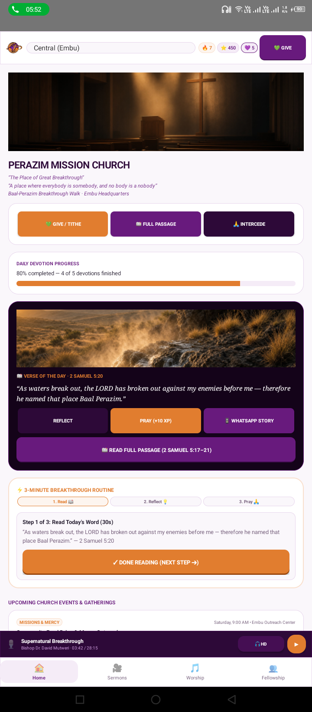
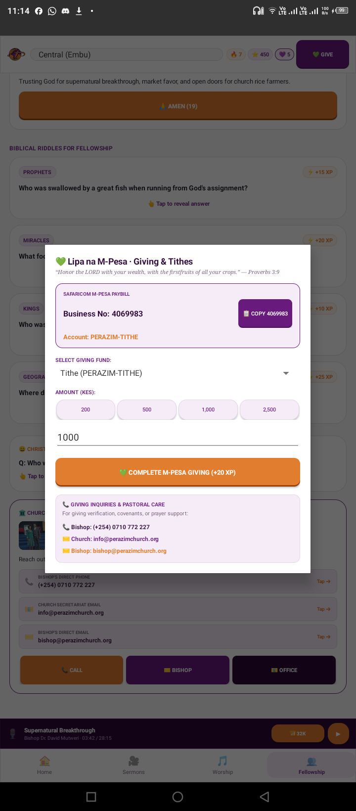
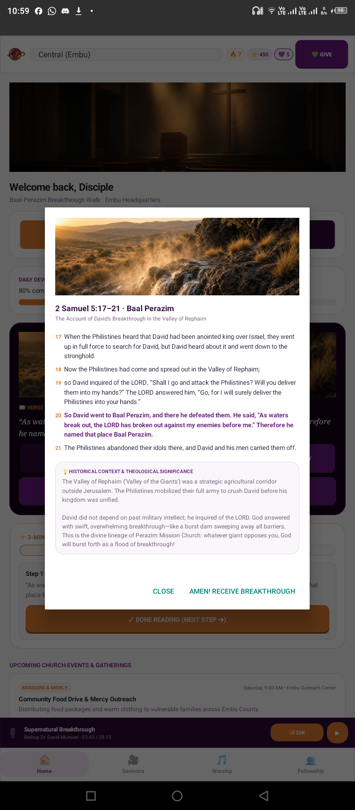
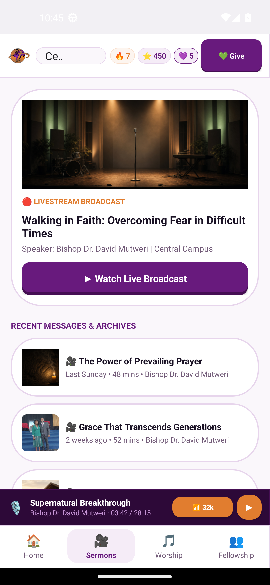
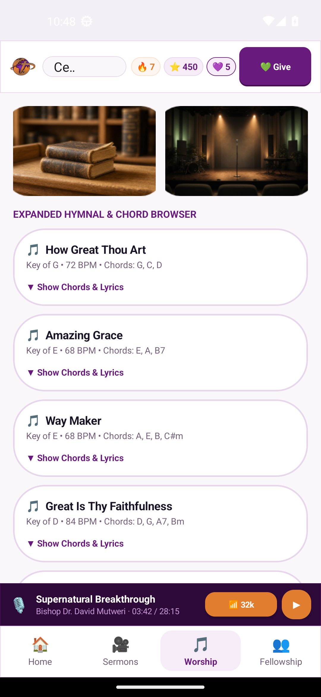
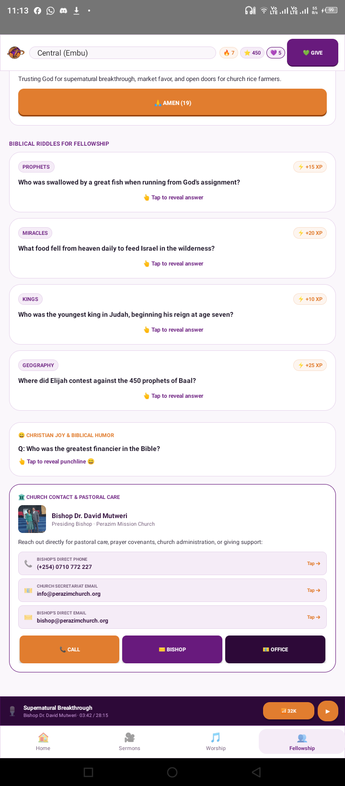
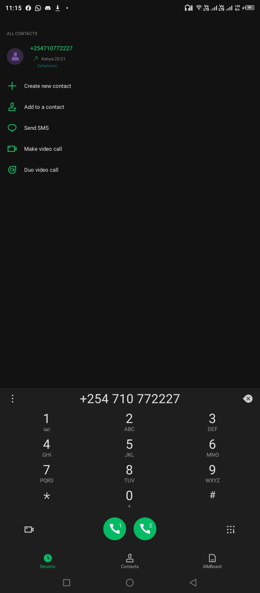

# PERAZIM MISSION CHURCH — Official Android Application

[](https://github.com/lmurugu/perazim-android/actions)
[](https://developer.android.com)
[](https://www.oracle.com/java/)
[](LICENSE)
[](https://developer.android.com)

> **Motto**: *“The Place of Great Breakthrough”*  
> **Slogan**: *“A place where everybody is somebody, and no body is a nobody”*

---

## 🏛️ Church Foundation & Canonical Identity

**PERAZIM MISSION CHURCH** is established on the covenant foundation of David's breakthrough at Baal-Perazim (*“As waters break out, the LORD has broken out against my enemies before me” — 2 Samuel 5:20*), headquartered in Embu, Kenya, and reaching the global community.

- **Church Name**: **PERAZIM MISSION CHURCH**
- **Motto**: *“The Place of Great Breakthrough”*
- **Slogan**: *“A place where everybody is somebody, and no body is a nobody”*
- **Vision**: *“To be a Center for Missions”*
- **Mission Statement**: *“Perazim exists to draw people to Christ, to disciple them to belong to His family, and to have them glorify GOD with their lives and their services.”*
- **Core Values**: `Evangelism` • `Discipleship` • `Fellowship` • `Worship` • `Ministry`

---

### Leadership & Secretariat Attribution
- **Presiding Bishop**: **Dr. David Mutweri**  
- **Bishop Direct Phone**: `(+254) 0710 772 227`  
- **Bishop Direct Email**: `bishop@perazimchurch.org`  
- **Church Secretariat Email**: `info@perazimchurch.org`  
- **Central Headquarters**: Embu, Kenya  
- **Safaricom Paybill**: `4069983`  
*Perazim Mission Church Global Ministries*

---

## 📱 Visual Showcase

| Home & Perazim Mission Church | Lipa na M-Pesa Giving | Scripture Reader (2 Sam 5) |
| :---: | :---: | :---: |
| <a href="docs/screenshots/live_screen_home.png"></a> | <a href="docs/screenshots/live_screen_giving_modal.png"></a> | <a href="docs/screenshots/live_screen_passage.png"></a> |

| Sermons & Audio Streaming | Worship & Chord Browser | Fellowship & Prayer Wall | Pastoral Dialer Integration |
| :---: | :---: | :---: | :---: |
| <a href="docs/screenshots/live_screen_sermons.png"></a> | <a href="docs/screenshots/live_screen_worship.png"></a> | <a href="docs/screenshots/live_screen_fellowship.png"></a> | <a href="docs/screenshots/live_screen_dialer.png"></a> |

---

## ✨ Feature Highlights

- 💚 **Lipa na M-Pesa Giving**: Integrated Safaricom M-Pesa integration targeting Paybill `4069983`, interactive fund routing (Tithe, Breakthrough Offering, Building Fund, Benevolence), one-touch amount chips (200, 500, 1,000, 2,500 KES), and native SIM toolkit / copy dispatch.
- 📖 **Full Scripture Reader**: 2 Samuel 5:17–21 narrative detailing David's victory at Baal-Perazim ("The Lord has broken through my enemies before me, like the breakthrough of waters"), accompanied by contextual pastoral exposition and verse analysis.
- ⚡ **3-Minute Breakthrough Routine**: Gamified spiritual discipline module featuring Read, Reflect, and Pray steps, complete with streak tracking, Grace Points, and leveling XP rewards.
- 🎙️ **Persistent Mini-Player & Data-Saver Audio**: Optimized for low-bandwidth African mobile network environments with efficient 32kbps AAC streaming audio playback and persistent background controls.
- 🎵 **Expanded Hymnal & Chord Browser**: Digital hymnal library featuring chord charts (guitar and keyboard) for timeless hymns, Swahili praise choruses, and modern worship anthems.
- 🤝 **Community Prayer Wall & Pastoral Care**: Real-time prayer petition board with intercession counters, praise report sharing, and direct one-tap pastoral connections (`[ Call ]`, `[ Bishop Email ]`, `[ Secretariat Email ]`).

---

## 📞 Pastoral Care & Official Contacts

Perazim Mission Church Central Campus is situated in Embu, Kenya, serving members locally and across the global diaspora.

- **Paybill Business Number**: `4069983`
- **Bishop Direct Phone**: `(+254) 0710 772 227`
- **Church Secretariat Email**: `info@perazimchurch.org`
- **Bishop Direct Email**: `bishop@perazimchurch.org`

---

## 🏛️ Architecture & Tech Stack

The Perazim Android application is architected for maximum responsiveness, low memory footprint, and instant startup times across all Android devices (Android 8.0 Oreo through Android 14+):

- **Core Language**: Java (Java 8 / Java 21 LTS compatible toolchains)
- **UI Architecture**: High-performance Native Android View hierarchy built programmatically for zero XML layout inflation overhead and instantaneous frame rendering.
- **Offline-First Asset Engine**: Local asset bundling for high-resolution graphics, hymnal chords, sermon audio metadata, and theological texts.
- **System Intents**: Seamless deep-linking to system dialer (`tel:`), email clients (`mailto:`), and clipboard managers.
- **Target SDK**: Android 34 (Android 14) with backward compatibility down to Android 8.0 (API 26) / Android 7.0 (API 24).

---

## 🛠️ Build & Installation Guide

### Prerequisites
- **Java Development Kit**: JDK 21 or JDK 17
- **Android SDK**: Build-tools `34.0.0` or `33.0.2`, Platforms `android-34`
- **Gradle**: Gradle 8.5+ (Wrapper included)

### Building with Gradle Wrapper
```bash
# Clone the repository
git clone https://github.com/lmurugu/perazim-android.git
cd perazim-android

# Build Debug APK
./gradlew assembleDebug

# The built APK will be located at:
# build/outputs/apk/debug/app-debug.apk
```

### Direct Toolchain Pipeline (Headless / Standalone CLI)
For continuous integration or lightweight development environments without full Gradle builds, the project compiles cleanly via direct Android SDK command-line tools:

```bash
# 1. Compile Java sources against android.jar
javac -d obj -cp "$ANDROID_HOME/platforms/android-34/android.jar" $(find src/main/java -name "*.java")

# 2. Convert bytecode to Dalvik Executable (D8)
$ANDROID_HOME/build-tools/34.0.0/d8 $(find obj -name "*.class") --output build/dex/

# 3. Package resources & compiled DEX with AAPT
$ANDROID_HOME/build-tools/34.0.0/aapt package -f -m \
  -F build/unaligned.apk \
  -M src/main/AndroidManifest.xml \
  -S src/main/res \
  -A src/main/assets \
  -I "$ANDROID_HOME/platforms/android-34/android.jar"

# 4. Add compiled classes.dex into APK
cd build/dex && zip -u ../unaligned.apk classes.dex && cd ../..

# 5. Optimize memory alignment (zipalign)
$ANDROID_HOME/build-tools/34.0.0/zipalign -v -p 4 build/unaligned.apk build/aligned.apk

# 6. Cryptographically sign APK (apksigner)
$ANDROID_HOME/build-tools/34.0.0/apksigner sign \
  --ks ~/.android/debug.keystore \
  --ks-pass pass:android \
  --out build/app-release-signed.apk \
  build/aligned.apk
```

### Deploying to Android Device or Emulator
```bash
# Check connected device
adb devices

# Install APK to device
adb install -r build/outputs/apk/debug/app-debug.apk

# Launch MainActivity directly via ADB
adb shell am start -n org.perazimchurch.app/.MainActivity
```

---

## 📂 Project Structure

```
perazim-android/
├── .github/
│   ├── ISSUE_TEMPLATE/
│   │   ├── bug_report.md
│   │   └── feature_request.md
│   ├── PULL_REQUEST_TEMPLATE.md
│   └── workflows/
│       └── build.yml
├── docs/
│   └── screenshots/
│       ├── live_screen_home.png
│       ├── live_screen_giving_modal.png
│       ├── live_screen_passage.png
│       ├── live_screen_sermons.png
│       ├── live_screen_worship.png
│       ├── live_screen_fellowship.png
│       └── live_screen_dialer.png
├── gradle/
│   └── wrapper/
│       ├── gradle-wrapper.jar
│       └── gradle-wrapper.properties
├── src/
│   └── main/
│       ├── AndroidManifest.xml
│       ├── assets/              # Offline church banners, campus art, hymns
│       ├── java/
│       │   └── org/perazimchurch/app/
│       │       ├── MainActivity.java
│       │       ├── SermonsActivity.java
│       │       ├── HymnsActivity.java
│       │       ├── ReflectionsActivity.java
│       │       ├── RiddlesActivity.java
│       │       └── JokesActivity.java
│       └── res/
│           ├── color/
│           ├── drawable/
│           └── values/
├── .gitignore
├── build.gradle
├── gradle.properties
├── gradlew
├── gradlew.bat
├── settings.gradle
├── LICENSE
├── CONTRIBUTING.md
├── CODE_OF_CONDUCT.md
└── SECURITY.md
```

---

## 🤝 Contributing

We welcome contributions from developers, designers, translators, and worshippers worldwide! Please read our [CONTRIBUTING.md](CONTRIBUTING.md) and adhere to the [CODE_OF_CONDUCT.md](CODE_OF_CONDUCT.md).

---

## 📄 License

This project is licensed under the MIT License — see the [LICENSE](LICENSE) file for details.  
Copyright © 2026 Perazim Mission Church & Contributors.
